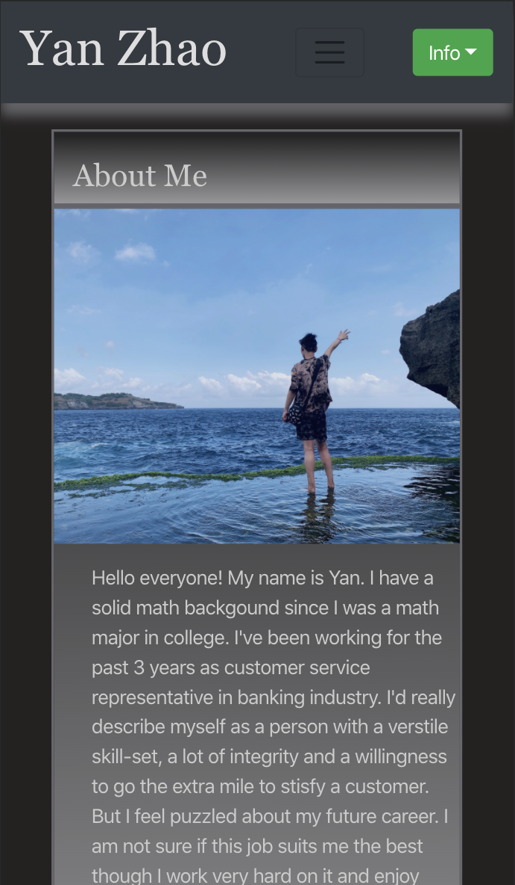
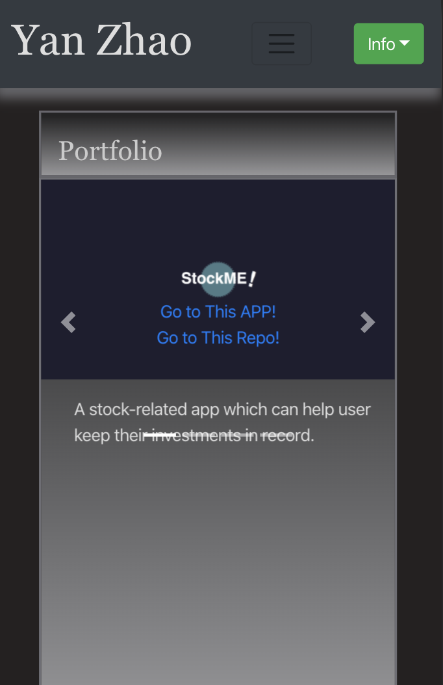
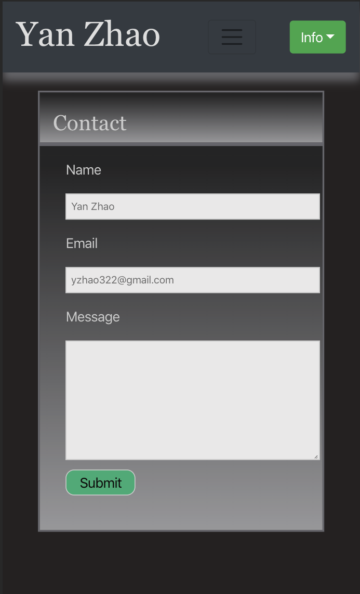

# My-Portfolio

[My portfolio page!](https://yzhao322.github.io/Portfolio/contact.html) - https://yzhao322.github.io/Portfolio/contact.html 

>1. This is myself-introduction page. The links to my LinkedIn page, Resume, Github are also in this page, right beside my picture. And on the nav bar, here's links to my portfolio and contact info.   

>2. This is page that shows my applications and projects. Each one have links to its deploy application page and github repo.   

>3. This is my contact page, and it shows my contact info. And also if you have any questions, you can submit on this page.   

